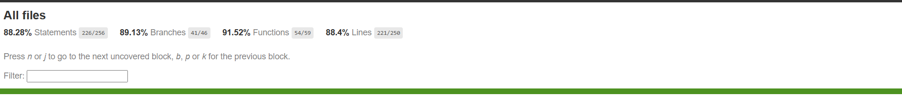
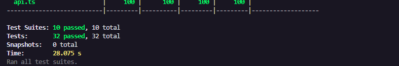

<h1 align="center">
  Desafio Técnico - NT Consult
<br />  
</h1>
 <p align="center"> <strong> Objetivo: Implementar o layout de uma página responsiva utilizando React, Sass , conforme as especificações fornecidas. </strong> </p>

##  :notebook_with_decorative_cover: Instruções
```git clone https://github.com/leandrohl/dragon-frontend.git ``` : para clonar o repositório do projeto
<br />
```npm install ``` : para a instalação das dependências
<br />
```npm run dev ``` : executar a aplicação frontend
<br />
```npm run test ``` : executar testes unitários

##  :notebook_with_decorative_cover: Acessos
**Email** : teste@gmail.com
<br />
**Senha** : 123456
<br />

##  :computer: Tecnologias utilizadas
- **React Js** — Biblioteca JavaScript para criação de interfaces de usuário dinâmicas.
- **Vite** — Ferramenta de desenvolvimento frontend ultrarrápida baseada em JavaScript e TypeScript.
- **Typesript** — Extensão do JavaScript com tipos estáticos opcionais para detecção precoce de erros.
- **Sass** — Linguagem de folha de estilo CSS com recursos avançados como variáveis e aninhamento.
- **Jest e Testing Library** — Framework e coleção de ferramentas para testes unitários focados no comportamento do usuário final.
- **Husky** — Ferramenta para configurar ganchos de Git para automatizar tarefas de pré-commit e pré-push.
- **ESLint** - Ferramenta que ajuda a identificar e corrigir problemas de estilo e erros no código, promovendo boas práticas de codificação.


## :bar_chart: Testes unitários




## :notebook: Requisitos para avaliação:

- Página de Login;
- Exibir dragões em ordem alfabética;
- Exibir detalhes de um dragão;
- Excluir dragão;
- Página de Edição de Dragões;
- Página de Cadastro de Dragões;
- Autenticação e Gerenciamento de Sessão;
- Testes Unitários.
